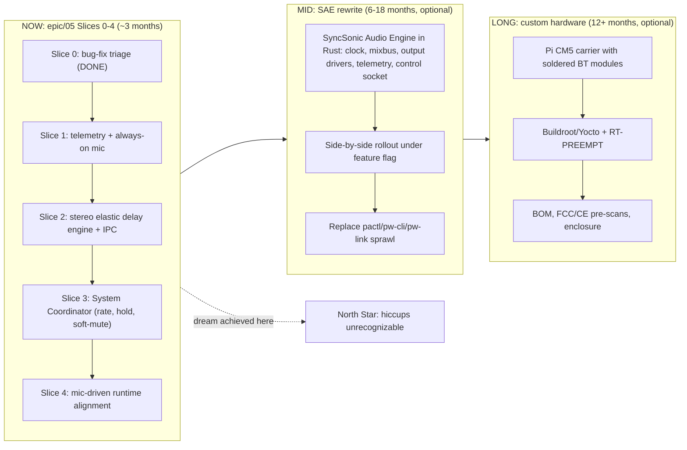

# SyncSonic Long-Term Roadmap

_The strategic horizon. If we're ever about to start a slice or merge an
epic, this is the document we read first to make sure the work still
serves the dream rather than drifting into incremental local
optimization._

This roadmap supersedes the transient `.cursor/plans/syncsonic_v2_commercial_roadmap_*.plan.md`
that was used to scope the early thinking; that plan has been folded in
here as the "Mid" and "Long" horizons. The active engineering plan is
in [`docs/maverick/proposals/05-coordinated-engine-architecture.md`](proposals/05-coordinated-engine-architecture.md);
this document frames why that plan exists and what comes after it.

## 1. North Star

> Any combination of Bluetooth and Wi-Fi speakers can be connected to
> SyncSonic and play audio from a phone in seamless sync. The system is
> stable and reliable. Brief Bluetooth transport stress on any one
> speaker is hidden from the listener — no audible click on the
> affected speaker, no perceptible drift between speakers, no hard
> disconnect. The owner of a motley collection of off-brand speakers
> gets an experience that feels like a single coherent audio
> environment.

That's the dream in the project owner's own framing. Commercialization
is **not** required to call this dream achieved. If we ship a system
that delivers the experience above on the existing Raspberry Pi 4 +
4-controller + USB-mic hardware, the project is a success. Anything
beyond that is optional and gated on whether the owner decides to take
it to market later.

## 2. Where We Are Today (2026-04-29 EDT)

- Active branch: [`epic/05-coordinated-engine`](epics/05-coordinated-engine.md),
  forked from `foundation/neutral-minimal`.
- **Slice 0 deployed and Pi-validated** on `syncsonic@10.0.0.89`.
  Evidence in section 8 of
  [the architecture proposal](proposals/05-coordinated-engine-architecture.md#8-slice-0-pi-validation-evidence-2026-04-29-edt).
- Hardware reality: Pi 4 with 4 BT controllers (1 UART on-board for
  advertising + 3 USB for output), 1 USB measurement microphone (Jieli
  UAC) currently `SUSPENDED`. Pi-CM-class custom carrier is plausible
  but not in scope until the dream is achieved on the current
  hardware.
- Architecture pivot in progress: from per-speaker, fixed-delay,
  teardown-on-stress to one coordinated elastic-buffer engine driven
  by a system-wide policy that holds all outputs accountable to each
  other. See the architecture proposal for the rationale and seven
  documented root-cause failure modes.

The four pre-existing epic lanes (01 PipeWire transport stability, 02
startup mic auto-alignment, 03 runtime ultrasonic auto-alignment, 04
Wi-Fi speakers manual alignment) are now reframed as **downstream
consumers** of the coordinated engine: each of them becomes much easier
to build correctly once the engine plus the System Coordinator plus the
telemetry stream exist.

## 3. The Three Horizons

The arrow from Now back to North Star is intentional: **the dream can
be reached in the Now horizon alone.** Mid and Long horizons exist to
make the result more deterministic, more portable, and (if desired)
shippable as a product, but they are not on the critical path to "the
system works."

### 3.1 Now horizon — Epic 05, Slices 0-4 (~3 months total)

This is the only horizon with active commitments. Detailed in
[`docs/maverick/proposals/05-coordinated-engine-architecture.md`](proposals/05-coordinated-engine-architecture.md#5-slice-plan).

| Slice | Outcome | Status |
|---|---|---|
| 0 | Bug-fix triage (phone-MAC guard, no-spin on offline, single-source priority.driver, one-shot auto-reconnect) + ship the WirePlumber rule to foundation | **DONE, Pi-validated 2026-04-29** |
| 1 | Telemetry layer + always-on mic capture + reproducible session report | next |
| 2 | Stereo elastic delay engine (replaces `pw_delay_filter.c`) with Unix-socket IPC; smooth in-place delay/rate changes with no xrun | pending |
| 3 | System Coordinator with bounded ±50 ppm rate adjustment, system-wide synchronous hold, soft-mute + phase-aligned re-entry on transport failure | pending |
| 4 | Mic-driven runtime alignment as a coordinator client | pending |

Each slice is independently deployable and produces objective evidence
on the Slice 1 telemetry stream. The dream is considered "delivered"
when Slice 3 lands and a 30-second session report through the
measurement harness shows zero audible dropouts under deliberate
stress (microwave on, BT scan in progress, USB hub power blip), with
inter-speaker drift below the perceptual threshold.

### 3.2 Mid horizon — SyncSonic Audio Engine (SAE) (6-18 months, optional)

Begin only after Slice 4 is real and the dream is achieved on the
PipeWire-based stack. The decision to start SAE is data-driven: the
Slice 1 telemetry stream is the input, and SAE is justified only if it
can demonstrably do better than the PW path on the same metrics, OR
if the PW path proves too costly to maintain (kernel/PW upgrade
breakage, scheduler unpredictability, etc.).

If the decision is yes:

- Single static Rust binary that owns mixing, routing, delay, scheduling,
  observability. No more `pactl`/`pw-cli`/`pw-link` subprocess sprawl.
- Architecture (modules per the proposal):
  - `engine/src/clock.rs` — single internal `CLOCK_MONOTONIC`-derived
    audio clock; all outputs slave to it.
  - `engine/src/mixbus.rs` — single SPSC ring per output from one mix
    thread; SCHED_FIFO + mlockall.
  - `engine/src/output/bt_a2dp.rs` — open ALSA PCM exposed by BlueZ
    directly, no PipeWire intermediation.
  - `engine/src/output/wifi_icecast.rs` — replaces the FFmpeg-into-Icecast
    path the README describes for Sonos.
  - `engine/src/delay.rs` — variable-delay element; direct lineage from
    `tools/pw_delay_filter.c` and the Slice 2 stereo elastic engine.
  - `engine/src/telemetry.rs` — the same jsonl schema as Slice 1, built
    in.
  - `engine/src/control.rs` — Unix socket / D-Bus surface that the
    existing BLE GATT layer talks to. **No frontend changes required.**
- Rollout: side-by-side under a feature flag, validated with the same
  Slice 1 measurement harness, cut over per output type (BT first, then
  Wi-Fi).
- Done when: SAE matches or beats the PW path on every Slice 1 metric
  AND the `pactl`/`pw-cli`/`pw-link` sprawl in
  [`backend/syncsonic_ble/helpers/pipewire_transport.py`](../../backend/syncsonic_ble/helpers/pipewire_transport.py)
  is removed.

The scope is **engine-only**. We keep BlueZ A2DP, the Linux kernel,
and Pi-class SoCs. The choice to keep BlueZ avoids a research project
and lets a single developer ship a v2 in months instead of years.

### 3.3 Long horizon — Custom hardware (12+ months, optional)

Entered only if SAE is stable and there is a real reason to leave the
Pi 4 SBC form factor (commercial intent, BOM cost pressure, thermal
constraints, multi-radio scheduling pain that SAE can't fully hide).
None of those are urgent today.

If entered:

- Pi CM5 (or CM4 if CM5 supply slips) on a custom carrier with multiple
  soldered BT modules instead of a USB hub. SAE binary runs unchanged
  because we picked the engine-only scope.
- Strip the OS to Buildroot or Yocto with an RT-PREEMPT kernel.
- BOM costing, enclosure thermals, FCC/CE pre-scans.
- Decision gate at the end: keep CM-class, or jump to a true embedded
  SoC (AM62x, i.MX RT class) and a much larger firmware project. The
  default is "stay CM-class" unless cost or supply forces otherwise.

Going-to-market work (legal, channel, manufacturing) is downstream of
this gate and is intentionally not in scope for the engineering
roadmap.

## 4. What Stays True Regardless of Horizon

These are the design principles every slice and every later horizon is
held to. They came out of the seven root-cause failure modes documented
in the architecture proposal and they have already informed Slice 0.

1. **Treat the system as one coordinated whole, not as N independent
   speakers.** The fast lane for jitter is bounded ±50 ppm rate
   adjustment per output; the panic lane for stress is a system-wide
   synchronous hold; the graceful failure for transport loss is a soft
   mute on the failing speaker plus a phase-aligned re-entry, never a
   teardown.
2. **Audio paths must be deterministic at the design level, not
   "deterministic if WirePlumber feels like it today."** Single source
   of truth for graph clock priority. Single owned set of routes per
   output. No surprises from autoconnect heuristics.
3. **Every claim about "this sounds better" has to be measured.** The
   Slice 1 telemetry + always-on mic + session-report harness is
   non-negotiable infrastructure for Slices 2-4 and beyond.
4. **The control plane is the source of truth, not the JSON file on
   disk.** State that diverges silently is a recurring class of bug
   (the warning storm and the phone MAC pollution observed on the Pi
   are both instances of this). The System Coordinator owns state in
   process.
5. **Reserve fast-lane response budget for the things humans hear.**
   Bounded rate adjustments are inaudible (humans can't perceive pitch
   shifts under ~1000 ppm at typical music spectra; we cap at ±50). A
   30 ms ramped soft mute is perceived as a fade-out, not a click. We
   trade these inaudible artifacts for the loud audible ones we have
   today.
6. **Phone audio is not a speaker.** The reserved adapter is a control
   plane, not an output. The phone-ingress path is structurally
   different and must be guarded against ever leaking into the speaker
   actuation surface (Slice 0 Fix A is this principle made executable).
7. **Pi-validation is mandatory for any change that affects BLE,
   audio routing, latency, or service startup.** Local checks
   (`compileall`, lint) are necessary but never sufficient. Slice 0's
   Pi validation surfaced two bugs that no static check could have
   caught (multi-path BlueZ entries, late-binding Python closure under
   threading).
8. **Keep optionality at every horizon boundary.** The Now horizon
   delivers the dream without committing to SAE. SAE delivers
   determinism without committing to custom hardware. Custom hardware
   delivers product-shippability without locking in a particular SoC
   family. Each step proves the previous one was correct before
   committing to the next.

## 5. Operating Cadence

- **Every slice is its own deployable unit** with a stated success
  criterion that is checked on the Pi, not just locally.
- **Every Pi deployment** takes a `tar -czf` snapshot of
  `/home/syncsonic/SyncSonicPi/backend/` first as the rollback artifact.
- **Every meaningful change** updates the architecture proposal's
  "Slice X Pi validation evidence" section with copy-pasteable journal
  excerpts and timestamps.
- **No epic ships without a measurement-backed report** once Slice 1
  lands. The four pre-existing epics (01-04) get retrofitted with an
  Experiment Ledger then.
- **Workstream summary lives in the architecture proposal**, not in
  the Cursor agent transcript. Transcripts are recoverable but not
  authoritative.

## 6. Open Questions Carried Forward

These are the questions we deliberately defer rather than answer
prematurely. They will be answered with telemetry data, not opinion.

- **On-board UART BT controller (`hci3`) versus a USB controller for
  advertising:** would freeing the on-board controller for one of the
  output speakers reduce dropouts? The on-board path has a much shorter
  HCI bus chain than the USB hub path. Slice 1 telemetry should make
  this answerable.
- **All four BT controllers + the mic share a single USB 2.0 host:**
  this is the most likely physical bottleneck. The Slice 3 Coordinator's
  bounded rate adjustments will compensate for jitter; if the
  adjustments saturate at ±50 ppm under normal load, the answer is
  hardware redistribution, not more software.
- **`bluez_output.F4..C8.1` accumulated `ERR 1` over 4h55m on the
  Pi.** Slice 1 must surface what that error was.
- **PipeWire 1.2.7 / WirePlumber 0.4.13 are older than upstream.** The
  current WP rule format matches 0.4.x; an upgrade to 0.5+ requires
  the new script-based form. Not urgent, but Slice 1 should log the
  versions so we know the moment the deployed Pi drifts.
- **Do we ever need more than 3 BT speakers?** Currently capped at 3
  by the number of USB BT dongles on the Pi 4. Going to 4+ is a
  hardware decision (more dongles, a different SoC, or eventually a
  custom carrier). Defer until Slices 0-4 prove the architecture.

## 7. Cross-References

- [`docs/maverick/WORKSTREAM_MODEL.md`](WORKSTREAM_MODEL.md) — branch model
  and epic lanes.
- [`docs/maverick/epics/05-coordinated-engine.md`](epics/05-coordinated-engine.md)
  — active epic scope.
- [`docs/maverick/proposals/05-coordinated-engine-architecture.md`](proposals/05-coordinated-engine-architecture.md)
  — full architecture rationale, seven root-cause failure modes, slice
  plan, Pi validation evidence.
- [`docs/maverick/epics/01-pipewire-transport-stability.md`](epics/01-pipewire-transport-stability.md),
  [`02-startup-mic-auto-alignment.md`](epics/02-startup-mic-auto-alignment.md),
  [`03-runtime-ultrasonic-auto-alignment.md`](epics/03-runtime-ultrasonic-auto-alignment.md),
  [`04-wifi-speakers-manual-alignment.md`](epics/04-wifi-speakers-manual-alignment.md)
  — pre-existing epic lanes, now reframed as downstream consumers of
  the coordinated engine.
- [`AGENTS.md`](../../AGENTS.md) — orchestration doctrine and
  verification baseline that every workstream has to meet.

## 8. When to Re-Read This Document

- Before starting any new slice or epic.
- Before merging anything bigger than a single-concern bug fix.
- When tempted to add scope that doesn't trace back to the North Star
  in section 1.
- When debating "should we spend a week on X?" and X isn't on the
  current slice.
- When considering accepting a contribution or commercial partnership
  inquiry.
- At least once a month even if none of the above applies, so drift
  gets caught early.
