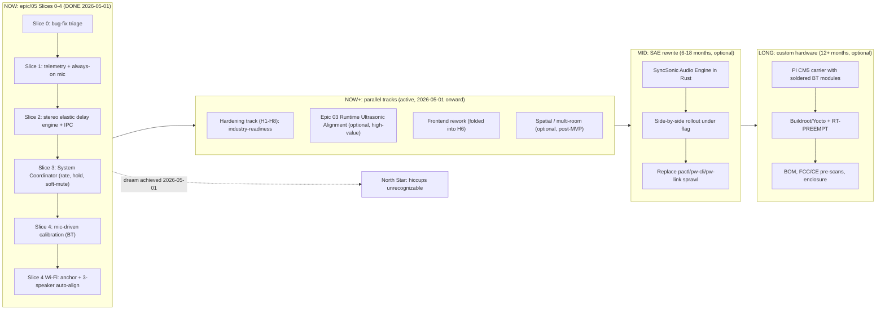

# SyncSonic Long-Term Roadmap

_The strategic horizon. If we're ever about to start a slice or merge an
epic, this is the document we read first to make sure the work still
serves the dream rather than drifting into incremental local
optimization._

This roadmap supersedes the transient `.cursor/plans/syncsonic_v2_commercial_roadmap_*.plan.md`
that was used to scope the early thinking; that plan has been folded in
here as the "Mid" and "Long" horizons. The active engineering plan is
in [`docs/maverick/proposals/05-coordinated-engine-architecture.md`](proposals/05-coordinated-engine-architecture.md);
this document frames why that plan exists and what comes after it.

## 1. North Star

> Any combination of Bluetooth and Wi-Fi speakers can be connected to
> SyncSonic and play audio from a phone in seamless sync. The system is
> stable and reliable. Brief Bluetooth transport stress on any one
> speaker is hidden from the listener — no audible click on the
> affected speaker, no perceptible drift between speakers, no hard
> disconnect. The owner of a motley collection of off-brand speakers
> gets an experience that feels like a single coherent audio
> environment.

That's the dream in the project owner's own framing. Commercialization
is **not** required to call this dream achieved. If we ship a system
that delivers the experience above on the existing Raspberry Pi 4 +
4-controller + USB-mic hardware, the project is a success. Anything
beyond that is optional and gated on whether the owner decides to take
it to market later.

## 2. Where We Are Today (2026-05-01 EDT)

**Milestone reached: 3-speaker BT + Wi-Fi auto-alignment perfectly aligned.**
The North Star is effectively achieved on the current PipeWire stack.
The user has confirmed multi-speaker hiccup-free playback with 3
speakers including a Wi-Fi (Sonos) anchor. From here the work is no
longer about chasing the dream — it is about **hardening for industry
readiness** and exploring optional advancement lanes.

- Active branch: [`epic/05-coordinated-engine`](epics/05-coordinated-engine.md),
  forked from `foundation/neutral-minimal`. Latest auto-alignment
  landing: commit `a18772b` (Wi-Fi anchor + 3-speaker validation),
  followed by chore + docs commits.
- **Slices 0–4 shipped and Pi-validated** on the primary target
  `syncsonic@10.0.0.89`. Evidence in the architecture proposal §8–17;
  the Wi-Fi anchor + 3-speaker lockdown in §18.
- **Epic 02 (startup mic auto-alignment) is done** — both startup-tune
  and music-based alignment buttons reach `applied` reliably across
  pure-BT and BT+Wi-Fi configurations after the 2026-05-01 robustness
  pass (10 s capture floor, 4 s post-signal tail, context-aware search
  window anchored on current filter delay, conf_secondary 1.2,
  anchor-fail aborts the sequence on Wi-Fi presence).
- **Epic 04 (Wi-Fi speakers) is folded into Epic 02 and is also done**
  — Sonos participates as a peer engine output in the calibration
  sequence, and the chirp anchor measures its 5 s acoustic lag
  reliably. There is no longer a separate "Wi-Fi manual alignment"
  workstream.
- **Next active technical lane: Epic 03 (runtime ultrasonic auto-
  alignment)** — see `docs/maverick/epics/03-runtime-ultrasonic-auto-alignment.md`.
  This is the only remaining audio-stack feature with high product
  value. Continuous in-playback correction during music removes the
  need for a startup or pause-before-align step and keeps speakers
  locked even as their codec / radio / clock drift on the order of
  tens of ms over an hour.

The four pre-existing epic lanes (01 PipeWire transport stability, 02
startup mic auto-alignment, 03 runtime ultrasonic auto-alignment, 04
Wi-Fi speakers manual alignment) are reframed as **downstream
consumers** of the coordinated engine. As of 2026-05-01:

| Epic | Status |
|---|---|
| 01 PipeWire transport stability | implicitly satisfied by Slice 2 elastic engine + Slice 3 coordinator on `epic/05` |
| 02 Startup mic auto-alignment | **done** — startup-tune + music buttons in production |
| 03 Runtime ultrasonic auto-alignment | next active lane — uncommitted |
| 04 Wi-Fi speakers manual alignment | **done** (auto-aligned, not manual) — folded into Epic 02 |

## 3. The Three Horizons

The Now horizon is closed. **The dream is achieved on the current
PipeWire-based stack with 3 speakers (2 BT + 1 Wi-Fi Sonos) perfectly
aligned end to end.** Now+ tracks are about turning that working system
into a deployable, sellable product (hardening) plus optional advanced
features (ultrasonic, spatial). Mid and Long horizons remain optional
and are entered only if the Pi-class platform proves insufficient.

### 3.1 Now horizon — Epic 05, Slices 0-4 (DONE 2026-05-01)

Closed. Detailed in
[`docs/maverick/proposals/05-coordinated-engine-architecture.md`](proposals/05-coordinated-engine-architecture.md#5-slice-plan).

| Slice | Outcome | Status |
|---|---|---|
| 0 | Bug-fix triage (phone-MAC guard, no-spin on offline, single-source priority.driver, one-shot auto-reconnect) + ship the WirePlumber rule to foundation | **DONE, Pi-validated 2026-04-29** |
| 1 | Telemetry layer + always-on mic capture + reproducible session report | **DONE**, Pi-validated (architecture §10) |
| 2 | Stereo elastic delay engine (`pw_delay_filter` elastic path) + Unix-socket IPC; smooth delay/gain without graph xruns | **DONE**, Pi-validated (architecture §11) |
| 3 | System Coordinator (soft-mute + RSSI-as-amplifier + BLE state/events at 1 Hz) | **DONE**, Pi-validated (architecture §12–16) |
| 4 | Mic-driven alignment: per-speaker sequential calibration + startup chirp + multi-speaker BLE | **DONE**, Pi-validated (architecture §17) |
| 4-Wi-Fi | Wi-Fi anchor measurement + 3-speaker BT+Sonos auto-alignment | **DONE**, Pi-validated 2026-05-01 (architecture §18) |

The Now horizon is closed: a perfectly aligned 3-speaker
(2 BT + 1 Wi-Fi Sonos) test on real hardware, end-to-end through the
phone app, was achieved 2026-05-01 EDT. Any further audio-quality
work moves to the **hardening track** (§3.2) or the **Epic 03 runtime
ultrasonic** lane (§3.3).

### 3.2 Now+ — Hardening track (industry-readiness)

_Promoted to the top priority by the project owner on 2026-05-01 once
the auto-alignment dream was confirmed working. The system functionally
delivers the experience; the work from here is **making it deployable,
sellable, and resilient** rather than adding more audio features._

The hardening track runs in parallel with whichever optional technical
lane (Epic 03 ultrasonic, frontend rework, spatial audio) is active.
Items are sized so any one of them can be picked up by an LLM agent
without holding the rest hostage.

**H1 — Crash-safe service lifecycle**
- `syncsonic.service` recovery story: what happens if the BLE GATT
  registration fails on first try, if `pw_delay_filter` segfaults, if
  the Icecast pipe sink dies mid-playback. Each path needs a
  documented behaviour, ideally a one-line journal log + automatic
  retry with backoff. Today there are several `RuntimeError`-on-first-
  failure code paths that depend on `Restart=on-failure` to mask them.
- Explicit liveness probe (a Unix-socket ping or a recurring
  telemetry heartbeat) that an external monitor could read to confirm
  the service is healthy, not just running.

**H2 — First-run + factory-reset UX**
- Clean install on a blank Pi: end-to-end script (BlueZ config, audio
  group, virtual_out, services, USB-mic detection) that can be run
  unattended and produces a verified-healthy node. The current
  `start_syncsonic.sh` mostly assumes the developer has done this
  manually in the past.
- Factory reset: `bluetoothctl remove`, clear `control_state.json`,
  flush `~/.config/syncsonic`, restart service.

**H3 — Telemetry retention + remote diagnostic export**
- Today's jsonl events grow forever in `~/syncsonic-telemetry/events/`.
  Add log rotation + a simple "export last N hours as a tarball" CLI
  so support can ask the user "send me your debug bundle".
- Bundle should also capture `journalctl -u syncsonic.service` for the
  same window, `pactl info`, `pw-cli list-objects`, BlueZ device list.

**H4 — BLE protocol versioning + forward compatibility**
- The phone app and the Pi exchange opcodes `0x68/0x69/0x73` etc.
  Today there is no explicit version handshake; if the Pi firmware
  drifts ahead of the phone app the phone silently drops new
  notifications. Add a single `protocol_version` field to the
  `STATUS_RESPONSE` opcode so the app can show a clear "update needed"
  banner instead of failing silently.

**H5 — Latency-keep regression**
- A recurring symptom on `epic/05`: per-speaker latency overrides
  saved by the user via the slider get reset to defaults across
  reboots in some edge cases. The `latencies` map is persisted both
  on the phone (AsyncStorage) and on the Pi (`control_state.json`)
  but the source-of-truth ordering when they disagree is undefined.
  Pick one, document it, and add a test case.

**H6 — Frontend interaction polish**
- The user listed frontend rework as a hardening priority. Specific
  cleanups already known:
  - `SpeakerConfigScreen.tsx` UI audit: button hierarchy, spacing,
    theming, status pill placement, sequence progress label, alarm
    fonts. Currently lints with 11 unused-import warnings that should
    be cleaned.
  - Layouts could use a richer card system (currently a single
    vertical list of speaker cards). Consider grouping cards by
    output type (BT vs Wi-Fi) once both are in production use.
  - Interactive interfaces: the `AnimatedGradient` and other unused
    visual components in `home.tsx` were imported but never wired —
    either ship them or remove them.
  - Per-speaker telemetry visualisation: RSSI dip meter, current
    vs target latency, recent soft-mute events. The
    `coordinatorState` BLE notifications are already wired in
    `useBLE.ts` but no component renders them yet (this is also
    listed in architecture proposal §16 deferred item 1).

**H7 — Pi snapshot + rollback discipline**
- Every Pi deploy already takes `tar -czf` of
  `/home/syncsonic/SyncSonicPi/backend/` per
  `.agents/skills/pi-hardware-verify/SKILL.md`. Formalize this into a
  numbered scheme (`pre-<commit>-<timestamp>`) and a one-shot rollback
  script. Stops "snapshots accumulating in /home" from being a
  silent disk-pressure issue at month 6.

**H8 — Commercial-readiness checklist**
- Not engineering work per se — but the project owner is starting to
  think about custom hardware and marketing, so this is the artifact
  that bridges engineering done to product ready. A checklist of
  every assumption baked into the current Pi 4 deployment that would
  fail on a different SoC, a different Linux distro, or a different
  audio stack version. Living document under `docs/maverick/`.

### 3.3 Optional technical lane — Epic 03 Runtime Ultrasonic Alignment

_See [`epics/03-runtime-ultrasonic-auto-alignment.md`](epics/03-runtime-ultrasonic-auto-alignment.md)._

The user has flagged this as the **highest-value remaining technical
work** for keeping the system stable. Today's calibration is a
discrete event triggered by a button press; runtime ultrasonic
alignment would close the loop continuously while music plays.

Why it matters: BT speakers drift on the order of 20-80 ppm against
each other, accumulating ~50 ms of relative offset over an hour at
the worst end. The current architecture corrects this only when the
user notices and re-aligns. A continuous correction at, say, 1 Hz
of inaudible ultrasonic bursts (>= 18 kHz, below most reflection
bandwidths) would absorb that drift before it becomes audible.

The Slice 2 elastic delay engine and the Slice 4 cross-correlation
analyzer are already capable of this; the missing pieces are:
- ultrasonic burst generator that integrates with the playback graph
  WITHOUT degrading the listening experience (psychoacoustic
  masking + speaker bandwidth gating)
- runtime measurement that doesn't require muting other speakers
  (already partially solved by the Slice 2 ring buffer + the
  per-speaker filter sockets)
- bounded runtime correction (cap at ±50 ppm rate adjustment per the
  ROADMAP §4.5 design principle; do not jump filter delay during
  music)
- UX: a switch to enable/disable in `SpeakerConfigScreen.tsx`, plus
  a small status pill showing "drift correction: on" and current
  correction magnitude

**Open question for the next session:** is ultrasonic better than
periodic chirp pulses inserted into musically-quiet regions? The
ultrasonic approach has two real risks (some speakers brick-wall
filter at 16 kHz; some pets hate it) that the chirp-in-quiet-region
approach avoids. Both are worth a small experiment before committing
to one.

### 3.4 Optional technical lane — Spatial / Multi-room Audio

Long-tail product expansion. Decoupled from MVP — the user has
explicitly noted this is "much more complicated and not at all
necessary for MVP." Documented here so the idea isn't lost:

- Per-speaker channel routing: today every speaker plays the same
  stereo mix. Future: assign speaker A as front-left, speaker B as
  rear-right, etc.
- Spatial audio formats (Atmos, Dolby Surround) decoded into N output
  speakers via the elastic engine.
- Home theater / TV setup: lip sync against a video source, accepting
  HDMI ARC/eARC into the Pi as an additional input.

These are listed only to capture the project owner's stated long-term
ambition. They are not on the engineering critical path and should
not be started until the hardening track + at least one of the
optional technical lanes is shipped.

### 3.5 Mid horizon — SyncSonic Audio Engine (SAE) (6-18 months, optional)

Begin only after Slice 4 is real and the dream is achieved on the
PipeWire-based stack. The decision to start SAE is data-driven: the
Slice 1 telemetry stream is the input, and SAE is justified only if it
can demonstrably do better than the PW path on the same metrics, OR
if the PW path proves too costly to maintain (kernel/PW upgrade
breakage, scheduler unpredictability, etc.).

If the decision is yes:

- Single static Rust binary that owns mixing, routing, delay, scheduling,
  observability. No more `pactl`/`pw-cli`/`pw-link` subprocess sprawl.
- Architecture (modules per the proposal):
  - `engine/src/clock.rs` — single internal `CLOCK_MONOTONIC`-derived
    audio clock; all outputs slave to it.
  - `engine/src/mixbus.rs` — single SPSC ring per output from one mix
    thread; SCHED_FIFO + mlockall.
  - `engine/src/output/bt_a2dp.rs` — open ALSA PCM exposed by BlueZ
    directly, no PipeWire intermediation.
  - `engine/src/output/wifi_icecast.rs` — replaces the FFmpeg-into-Icecast
    path the README describes for Sonos.
  - `engine/src/delay.rs` — variable-delay element; direct lineage from
    `tools/pw_delay_filter.c` and the Slice 2 stereo elastic engine.
  - `engine/src/telemetry.rs` — the same jsonl schema as Slice 1, built
    in.
  - `engine/src/control.rs` — Unix socket / D-Bus surface that the
    existing BLE GATT layer talks to. **No frontend changes required.**
- Rollout: side-by-side under a feature flag, validated with the same
  Slice 1 measurement harness, cut over per output type (BT first, then
  Wi-Fi).
- Done when: SAE matches or beats the PW path on every Slice 1 metric
  AND the `pactl`/`pw-cli`/`pw-link` sprawl in
  [`backend/syncsonic_ble/helpers/pipewire_transport.py`](../../backend/syncsonic_ble/helpers/pipewire_transport.py)
  is removed.

The scope is **engine-only**. We keep BlueZ A2DP, the Linux kernel,
and Pi-class SoCs. The choice to keep BlueZ avoids a research project
and lets a single developer ship a v2 in months instead of years.

### 3.6 Long horizon — Custom hardware (12+ months, optional)

Entered only if SAE is stable and there is a real reason to leave the
Pi 4 SBC form factor (commercial intent, BOM cost pressure, thermal
constraints, multi-radio scheduling pain that SAE can't fully hide).
None of those are urgent today.

If entered:

- Pi CM5 (or CM4 if CM5 supply slips) on a custom carrier with multiple
  soldered BT modules instead of a USB hub. SAE binary runs unchanged
  because we picked the engine-only scope.
- Strip the OS to Buildroot or Yocto with an RT-PREEMPT kernel.
- BOM costing, enclosure thermals, FCC/CE pre-scans.
- Decision gate at the end: keep CM-class, or jump to a true embedded
  SoC (AM62x, i.MX RT class) and a much larger firmware project. The
  default is "stay CM-class" unless cost or supply forces otherwise.

Going-to-market work (legal, channel, manufacturing) is downstream of
this gate and is intentionally not in scope for the engineering
roadmap.

## 4. What Stays True Regardless of Horizon

These are the design principles every slice and every later horizon is
held to. They came out of the seven root-cause failure modes documented
in the architecture proposal and they have already informed Slice 0.

1. **Treat the system as one coordinated whole, not as N independent
   speakers.** The fast lane for jitter is bounded ±50 ppm rate
   adjustment per output; the panic lane for stress is a system-wide
   synchronous hold; the graceful failure for transport loss is a soft
   mute on the failing speaker plus a phase-aligned re-entry, never a
   teardown.
2. **Audio paths must be deterministic at the design level, not
   "deterministic if WirePlumber feels like it today."** Single source
   of truth for graph clock priority. Single owned set of routes per
   output. No surprises from autoconnect heuristics.
3. **Every claim about "this sounds better" has to be measured.** The
   Slice 1 telemetry + always-on mic + session-report harness is
   non-negotiable infrastructure for Slices 2-4 and beyond.
4. **The control plane is the source of truth, not the JSON file on
   disk.** State that diverges silently is a recurring class of bug
   (the warning storm and the phone MAC pollution observed on the Pi
   are both instances of this). The System Coordinator owns state in
   process.
5. **Reserve fast-lane response budget for the things humans hear.**
   Bounded rate adjustments are inaudible (humans can't perceive pitch
   shifts under ~1000 ppm at typical music spectra; we cap at ±50). A
   30 ms ramped soft mute is perceived as a fade-out, not a click. We
   trade these inaudible artifacts for the loud audible ones we have
   today.
6. **Phone audio is not a speaker.** The reserved adapter is a control
   plane, not an output. The phone-ingress path is structurally
   different and must be guarded against ever leaking into the speaker
   actuation surface (Slice 0 Fix A is this principle made executable).
7. **Pi-validation is mandatory for any change that affects BLE,
   audio routing, latency, or service startup.** Local checks
   (`compileall`, lint) are necessary but never sufficient. Slice 0's
   Pi validation surfaced two bugs that no static check could have
   caught (multi-path BlueZ entries, late-binding Python closure under
   threading).
8. **Keep optionality at every horizon boundary.** The Now horizon
   delivers the dream without committing to SAE. SAE delivers
   determinism without committing to custom hardware. Custom hardware
   delivers product-shippability without locking in a particular SoC
   family. Each step proves the previous one was correct before
   committing to the next.

## 5. Operating Cadence

- **Every slice is its own deployable unit** with a stated success
  criterion that is checked on the Pi, not just locally.
- **Every Pi deployment** takes a `tar -czf` snapshot of
  `/home/syncsonic/SyncSonicPi/backend/` first as the rollback artifact.
- **Every meaningful change** updates the architecture proposal's
  "Slice X Pi validation evidence" section with copy-pasteable journal
  excerpts and timestamps.
- **No epic ships without a measurement-backed report** once Slice 1
  lands. The four pre-existing epics (01-04) get retrofitted with an
  Experiment Ledger then.
- **Workstream summary lives in the architecture proposal**, not in
  the Cursor agent transcript. Transcripts are recoverable but not
  authoritative.

## 6. Open Questions Carried Forward

These are the questions we deliberately defer rather than answer
prematurely. They will be answered with telemetry data, not opinion.

- **On-board UART BT controller (`hci3`) versus a USB controller for
  advertising:** would freeing the on-board controller for one of the
  output speakers reduce dropouts? The on-board path has a much shorter
  HCI bus chain than the USB hub path. Slice 1 telemetry should make
  this answerable.
- **All four BT controllers + the mic share a single USB 2.0 host:**
  this is the most likely physical bottleneck. The Slice 3 Coordinator's
  bounded rate adjustments will compensate for jitter; if the
  adjustments saturate at ±50 ppm under normal load, the answer is
  hardware redistribution, not more software.
- **`bluez_output.F4..C8.1` accumulated `ERR 1` over 4h55m on the
  Pi.** Slice 1 must surface what that error was.
- **PipeWire 1.2.7 / WirePlumber 0.4.13 are older than upstream.** The
  current WP rule format matches 0.4.x; an upgrade to 0.5+ requires
  the new script-based form. Not urgent, but Slice 1 should log the
  versions so we know the moment the deployed Pi drifts.
- **Do we ever need more than 3 BT speakers?** Currently capped at 3
  by the number of USB BT dongles on the Pi 4. Going to 4+ is a
  hardware decision (more dongles, a different SoC, or eventually a
  custom carrier). Defer until Slices 0-4 prove the architecture.

## 7. Cross-References

- [`docs/maverick/WORKSTREAM_MODEL.md`](WORKSTREAM_MODEL.md) — branch model
  and epic lanes.
- [`docs/maverick/epics/05-coordinated-engine.md`](epics/05-coordinated-engine.md)
  — active epic scope.
- [`docs/maverick/proposals/05-coordinated-engine-architecture.md`](proposals/05-coordinated-engine-architecture.md)
  — full architecture rationale, seven root-cause failure modes, slice
  plan, Pi validation evidence.
- [`docs/maverick/epics/01-pipewire-transport-stability.md`](epics/01-pipewire-transport-stability.md),
  [`02-startup-mic-auto-alignment.md`](epics/02-startup-mic-auto-alignment.md),
  [`03-runtime-ultrasonic-auto-alignment.md`](epics/03-runtime-ultrasonic-auto-alignment.md),
  [`04-wifi-speakers-manual-alignment.md`](epics/04-wifi-speakers-manual-alignment.md)
  — pre-existing epic lanes, now reframed as downstream consumers of
  the coordinated engine.
- [`AGENTS.md`](../../AGENTS.md) — orchestration doctrine and
  verification baseline that every workstream has to meet.

## 8. When to Re-Read This Document

- Before starting any new slice or epic.
- Before merging anything bigger than a single-concern bug fix.
- When tempted to add scope that doesn't trace back to the North Star
  in section 1.
- When debating "should we spend a week on X?" and X isn't on the
  current slice.
- When considering accepting a contribution or commercial partnership
  inquiry.
- At least once a month even if none of the above applies, so drift
  gets caught early.
