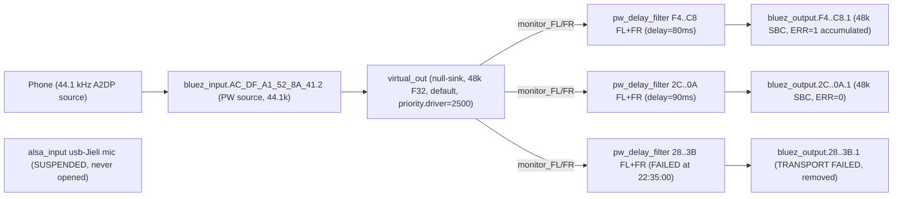
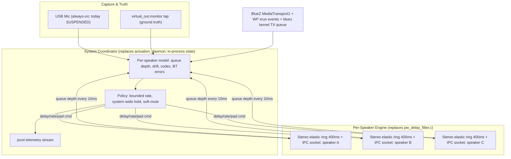

# Epic 05: Coordinated Engine — Architecture Proposal

_Status: proposed; Slice 0 in progress on `epic/05-coordinated-engine`._

This document is the long-form rationale, evidence, and slice plan for
[Epic 05](../epics/05-coordinated-engine.md). It is the source of truth
for "why" we are doing this work; the epic doc is the source of truth for
"what" and "how it will be validated."

## 1. The Pivot In One Paragraph

The per-speaker delay filter, the manual alignment slider, the disabled
ultrasonic runtime correction feature, and the response to a Bluetooth
transport failure should all be the same physical mechanism, controlled
by a single system-wide coordinator that holds every output accountable
to every other output. Today they are four disconnected systems that
contradict each other. That contradiction is the source of every
"hiccup" the listener hears today.

## 2. What Actually Runs on the Pi

Live evidence captured 2026-04-28 ~22:35 EDT, while three speakers were
playing.



Concrete observations:

- 4 BT controllers: `hci3` (UART, on-board, advertising) plus `hci0/1/2`
  (USB output)
- `virtual_out` runs at 512-sample quantum @ 48 kHz, BUSY ≈ 8 µs, ERR 0
- `bluez_output.F4_6A_DD_D4_F3_C8.1` BUSY 60–77 µs, **ERR 1** silently
  accumulated over 4h55m
- the phone enters at **44.1 kHz**, gets resampled inside `virtual_out`
  to 48 kHz before fan-out
- the per-speaker `pw_delay_filter` processes link directly between
  `virtual_out:monitor_FL/FR` and `bluez_output:playback_FL/FR` — there
  is no stage null-sink and no PA loopback in the live chain, despite
  what the local `wip/01-pipewire-transport-phone-ingress` version of
  `pipewire_transport.py` claims
- the deployed `pipewire_transport.py` is 398 lines and ships the older
  `"PipeWire delay transport established"` log line; the local wip
  version is 559 lines with a different message — local code is ahead

## 3. Why Hiccups Are Perceptible Today (Seven Root Causes With Evidence)

### 3.1 The control plane and physical reality silently diverge

`/tmp/syncsonic_pipewire/control_state.json` listed the phone MAC
`AC:DF:A1:52:8A:41` as an active speaker output. The actuation daemon
polled every 250 ms and emitted

```
WARNING - PipeWire transport sink not found for AC:DF:A1:52:8A:41
```

over 800 times in 6 minutes. There is no source of truth and no observer
that flags the disagreement.

### 3.2 Manual latency adjustments cause graph xruns every time

```
22:14:41 wireplumber: (bluez_output.2C_FD_B4_69_46_0A.1-120) graph xrun not-triggered
22:14:41 syncsonic: PipeWire delay transport established for 2C:FD:B4:69:46:0A ... (delay 90.0 ms)
```

Same pattern at 21:33:28. `pipewire_transport.py:ensure_route` rebuilds
the route whenever the requested delay differs by ≥ 0.5 ms. The
underlying `pw_delay_filter.c` already has a ring buffer that could
adjust `delay_samples` live; it does not because there is no IPC into
it.

### 3.3 A speaker dropped at 22:35:00 and the system response was teardown, not recovery

```
22:35:00 pipewire: (virtual_out-74) graph xrun pending:1/11 waiting:1593926us process:31463us
22:35:00 wireplumber: Failure in Bluetooth audio transport /org/bluez/hci1/dev_28_FA_19_B6_0E_3B/sep2/fd2
22:35:00 syncsonic: [BlueZ] 28:FA:19:B6:0E:3B is now DISCONNECTED
22:35:00 syncsonic: PipeWire delay transport removed for 28:FA:19:B6:0E:3B
```

The JBL Flip 6 had a 1.6 second gap, BlueZ flagged the A2DP transport
failed, WirePlumber tore down the bluez_output node, the code's response
was log + nuke route + tell app the speaker is gone. No retry, no
recovery, no protection of the other two speakers from the propagated
xrun.

### 3.4 Three independent timing domains, weakly coupled

The audio path has three clocks: virtual_out (system, 48 kHz, 512-sample
quantum), per-speaker A2DP transport (speaker crystal, ±20–80 ppm drift
plus retransmit jitter), and the phone source (44.1 kHz, drifting
independently of virtual_out). PipeWire absorbs differences at three
elastic points (input resampler, virtual_out monitor read, A2DP encoder
queue), each with its own behavior. There is no system-level model of
total accumulated drift. The delay filter is fixed-delay and does not
compensate.

### 3.5 WirePlumber and our code race for graph clock priority

The custom WirePlumber rule pins all bluez nodes to `priority.driver=100`.
The wip-branch `pulseaudio_helpers.py` does a separate `pw-cli set-param
priority.driver=2500` on `virtual_out` after creation. The
`module-null-sink` load also passes `priority.driver=5000`. Three
sources, three values. If WirePlumber re-applies its rule on a bluez
reconnect and the post-create promotion isn't re-run, a bluez_output
with default `priority.driver=1010` can become the graph clock master,
and any BT transport jitter stalls every speaker.

### 3.6 The phone enters at 44.1 kHz and we don't know it

`bluez_input.AC_DF_A1_52_8A_41.2` runs at 44100 Hz; everything
downstream is 48 kHz. Resampling happens silently in PipeWire. If the
phone's A2DP source briefly stalls (iOS/Android background, notification
service), the resampler underruns and the click fan-outs to all
speakers. There is no telemetry on the resampler.

### 3.7 There is no observability anywhere

When a hiccup happens we do not know which queue underran, how deep the
BT TX queue was at the time, whether the A2DP bitpool dropped (a sudden
drop from 53 to 35 sounds like a quality crash), whether USB IRQ
contention spiked, or which speaker slipped first. The user reacts with
the slider; the slider causes an xrun (3.2). It is a self-undermining
loop.

## 4. The Architecture That Solves This

### 4.1 The single idea

The per-speaker delay filter, the alignment actuator, and the runtime
correction loop are **the same physical mechanism**: a per-speaker
elastic-buffer engine that accepts a target delay (slow lane, for
alignment), a bounded rate offset in PPM (fast lane, for jitter and
drift), and emergency commands (immediate pad / soft mute / ramped
re-entry) over a single Unix-socket control surface, controlled by a
**single system coordinator** that owns global state.

### 4.2 The runtime topology



### 4.3 The three policy primitives

**Bounded rate adjustment (the "fast lane").** A per-speaker rate offset
in PPM, clamped to ±50 ppm. Applied continuously by a per-speaker PI
controller targeting 50% buffer depth. ±50 ppm is inaudible; humans
don't perceive pitch shifts below ~1000 ppm at typical music spectra.
Replaces all "manual rate matching."

**System-wide synchronous hold (the "panic lane").** When **any one**
speaker's queue starts draining faster than its rate adjustment can
compensate, the coordinator applies a small system-wide rate slowdown
(−20 ppm, ~200 ms) to **all** speakers. Because all speakers slow
together, no inter-speaker drift is perceptible — the listener perceives
a tiny overall stretch which is also inaudible. This is the magic that
makes hiccups unrecognizable: we do not try to save the failing speaker
by speeding it up (which would cause pitch artifacts), we let everyone
wait for the failing speaker to catch back up.

**Soft mute + phase-aligned re-entry (the "graceful failure").** When a
speaker's BT transport actually fails: ramp its output to silence over
30–50 ms (perceived as a fade-out, not a click), keep the other speakers
stable on the system clock, attempt BlueZ A2DP re-establish without
`RemoveDevice`, when the transport is back wait until the next
phase-aligned beat boundary in the rate-adjusted timeline, ramp back in.
Listener experience: one speaker briefly fades and returns, others
uninterrupted. This is the quality bar AirPlay and Sonos meet.

### 4.4 What we keep, what we refactor, what we scrap

| Keep as-is | Refactor | Scrap |
|---|---|---|
| BLE GATT service `infra/gatt_service.py` | `pw_delay_filter.c` — keep architecture, add IPC socket, deepen ring to 400 ms, support stereo in one process, add queue-depth reporting | Hybrid stage+loopback dead code in the wip-branch `pipewire_transport.py` — never deployed, won't be needed |
| BlueZ FSM in `connection_manager.py` `_try_reconnect` | `pipewire_actuation_daemon.py` becomes the System Coordinator with a real model, not a 250 ms JSON poller | JSON-on-disk control plane in `pipewire_control_plane.py` — coordinator owns state in process |
| Per-MAC adapter scheduling in `action_planning.py:connect_one_plan` | `alignment_actuator.py:step()` becomes the policy engine instead of just translating delay→delay-line | Three-place priority.driver setting — collapse to one, owned by the coordinator |
| WirePlumber BT priority pinning rule (currently untracked in `wip/01`) | `pulseaudio_helpers.py` shrinks; coordinator handles graph state | Per-speaker FL+FR as 2 separate processes — collapse to 1 stereo process per speaker, halves PID count |
| Phone ingress via WirePlumber autoconnect | Add the missing guards so the phone MAC never enters the speaker control plane | Unused `Sonos`/Wi-Fi feature flags scattered across handlers |

The USB measurement microphone (`alsa_input.usb-Jieli_Technology_UACDemoV1.0_*`)
is already plugged in and recognized by PipeWire. It is currently
`SUSPENDED` because nothing opens it. Once we open it in Slice 1, the
coordinator has its truth source for free.

## 5. Slice Plan

Each slice is small, independently deployable to the Pi, and produces
objective evidence on the Slice 1 telemetry stream.

### Slice 0: Bug-fix triage (1 day)

Concrete bugs we have direct evidence for in the journal. Do them first
because they make the system stop lying to itself.

- Add a phone-MAC guard so the phone's MAC can never reach the speaker
  control plane via `handle_set_latency`, `handle_set_volume`, or
  `publish_output_*`. Defense in depth: also guard `_ensure_output_actuation`
  in `connection_manager.py`. Kills the 410 ms warning storm and
  recovers some CPU.
- `transport.ensure_route` records "speaker offline" once per MAC and
  stops re-trying until a fresh `Connected` event fires. The actuation
  daemon honors this; no more 250 ms spin warning.
- Collapse priority.driver to one source. Ship the WirePlumber rule
  (currently untracked at `backend/wireplumber/bluetooth.lua.d/...`) to
  the foundation, set `priority.driver=10000` on the `module-null-sink`
  load line, and remove any post-create `pw-cli set-param` promotion.
- One-shot auto-reconnect when an "expected" speaker disconnects
  unexpectedly: requeue a single `Intent.CONNECT_ONE` instead of
  immediately giving up. The existing FSM handles its 3-attempt internal
  retry.

**Success criterion (Pi-validated):** journal shows zero
`transport sink not found` warning loops; one transient BT failure
recovers without speaker disconnect at the user-visible layer; latency
slider on a non-existent speaker MAC produces no xrun.

### Slice 1: Telemetry + measurement harness (1 week)

You can't fix what you can't see. No behavior change; the system gets
honest.

- Wake the USB mic. Tiny capture process always-on records a 30-second
  rolling window from `alsa_input.usb-Jieli...` to a memory ring.
  Becomes ground truth for everything.
- One jsonl per session at `/var/log/syncsonic/session-<ts>.jsonl` with
  structured events (`pw_xrun`, `bluez_transport_error`,
  `delay_filter_queue_depth`, `route_create`, `route_teardown`,
  `set_latency_request`, `mic_rms_window`), all timestamped with
  `CLOCK_MONOTONIC`.
- Pipe `pw-mon` (or periodic `pw-cli ls Node` snapshots) every 1 s into
  the same stream so we capture priority.driver changes, codec changes,
  and bluez node states.
- BlueZ `MediaTransport1` property snapshots (Codec, Volume, Delay,
  Configuration) every 5 s.
- One command (`make session NAME=test1`) plays a fixed 30 s music
  sample, captures everything, produces a single-page report: dropout
  count, inter-speaker drift, codec changes, xrun count.

**Success criterion (Pi-validated):** `make session` twice with no code
changes produces reproducible numbers within ±5%.

### Slice 2: Stereo elastic delay engine + IPC (2 weeks)

Replace per-speaker FL+FR processes with a single stereo elastic ring
per speaker, controlled over a Unix socket.

- Rewrite `pw_delay_filter.c`:
  - One process per speaker, stereo (FL+FR) sharing one ring buffer
    (400 ms / 38400 samples per channel)
  - Unix socket at `/tmp/syncsonic-engine/<mac>.sock` accepting
    line-based commands: `set_delay <ms>`, `set_rate_ppm <ppm>`,
    `pad <samples>`, `mute_ramp <ms>`, `query`
  - Smoothly interpolates `delay_samples` toward `set_delay` over ~10 ms
    (no xrun, no pop)
  - Applies `rate_ppm` by inserting/dropping 1 sample every
    `(1e6 / |ppm|)` frames using linear interpolation around the read
    pointer (transparent at ±50 ppm)
  - Reports queue depth, frames in/out, errors via `query` response
- Update the daemon to send `set_delay` over the socket instead of
  restarting the process

**Success criterion (Pi-validated):** continuously adjust the slider
50→300→50 ms with music playing; session report shows zero xruns. Today
every adjustment xruns.

### Slice 3: System Coordinator (2 weeks)

Replace `pipewire_actuation_daemon.py` with a coordinator that owns
state in-process.

- In-process per-speaker model: `target_delay_ms`, `current_delay_ms`,
  `current_rate_ppm`, `queue_depth_samples`, `queue_depth_target`,
  `bt_transport_state`, `last_xrun_ts`, `consecutive_stress_ms`
- 20 ms tick: read every speaker's `query` response from its socket,
  read latest WP xrun events from the jsonl tap, read BlueZ
  `MediaTransport1` deltas
- Policy:
  - Each tick, compute a per-speaker rate adjustment proportional to
    `(queue_depth − target)`. PI controller, clamp to ±50 ppm.
  - If any speaker's `consecutive_stress_ms > 100`, apply a system-wide
    rate slowdown of −20 ppm for 200 ms.
  - If any speaker's queue is `< 10%` and BT transport state shows
    error/buffering, soft-mute that speaker (`mute_ramp 50`), schedule
    re-establish, do not disconnect.
- BLE notifications expose per-speaker queue health, not just
  connected/disconnected, so the app can show drift bars and dropout
  warnings.

**Success criterion (Pi-validated):** with a 2.4 GHz interferer (microwave
running, BT scan in progress, USB hub power blip via `uhubctl -p X -a
0`), the session report shows other speakers maintained zero audible
dropout while the stressed speaker dipped queue, was held by the
coordinator, and recovered without disconnect.

### Slice 4: Mic-based runtime alignment (2 weeks)

Now that the actuator takes rate adjustments smoothly, mic alignment is
~200 lines of Python.

- Use the always-on mic capture from Slice 1.
- Periodically (every 30 s of stable playback) cross-correlate the mic
  signal against the `virtual_out.monitor` tap to estimate per-speaker
  time-of-arrival relative to the system clock.
- Compute the ideal delay per speaker based on physical position and
  target alignment.
- Send `target_delay_ms` to each speaker's coordinator entry. The
  coordinator smoothly retargets the engine over a few seconds — no
  audible artifacts.
- "Auto-align" mode triggered from the app plays a short reference
  signal, computes alignment in 5 s, applies smoothly. This is Epic 02
  done correctly.

**Success criterion (Pi-validated):** "auto-align" pressed while music is
playing; mic correlation peaks tighten measurably; the user cannot hear
when alignment is being applied.

### Beyond Slice 4

Ultrasonic continuous correction (Epic 03), Wi-Fi speakers (Epic 04),
and additional BT controllers all become natural extensions: more ways
to feed `target_delay_ms` to the coordinator, and more output drivers
that speak the same socket protocol.

## 6. Open Questions and Risks

- **The on-board UART BT controller (`hci3`, BD `2C:CF:67:CE:57:91`,
  Cypress) is reserved for advertising and currently goes into
  `Link mode: PERIPHERAL ACCEPT` with `RX bytes:673M`.** Worth checking
  whether reserving a USB controller for advertising and freeing the
  on-board UART controller for output gives more deterministic timing,
  since the on-board controller has an HCI bus path that is much shorter
  than the USB hub chain. Slice 1 telemetry should make this answerable.
- **All 4 BT controllers + the mic share a single USB 2.0 host through
  two stacked hubs.** This is the most likely physical bottleneck. The
  coordinator's bounded rate adjustments will compensate for the
  resulting jitter; if the adjustments saturate at ±50 ppm under normal
  load, the right answer is to redistribute USB devices across the Pi's
  USB 3.0 host or to add a second hub on the second USB 2.0 controller.
- **`bluez_output.F4..C8.1` accumulated `ERR 1` over 4h55m.** Slice 1
  must surface what that error was. It is not surfaced anywhere today.
- **PipeWire 1.2.7 with WirePlumber 0.4.13** is older than current
  upstream. The WP rule format used here matches 0.4.x; if we ever
  upgrade WirePlumber to 0.5+, the rule needs the new script-based form.
  Not urgent.

## 7. Honest Answer to "Is the dream achievable on this hardware?"

Yes. The Pi 4 with its current BT controllers, USB topology, and the
Jieli mic has more than enough capability to deliver the seamless
experience the project description aims for. The reason a year of work
hasn't gotten there is that the architecture treats each speaker as
independent and reacts to stress with teardown. The pivot is to treat
the system as one coordinated whole and ride through stress with
bounded, inaudible adjustments. The hardware is fine. The pivot is one
slice at a time and we will measure each one.
